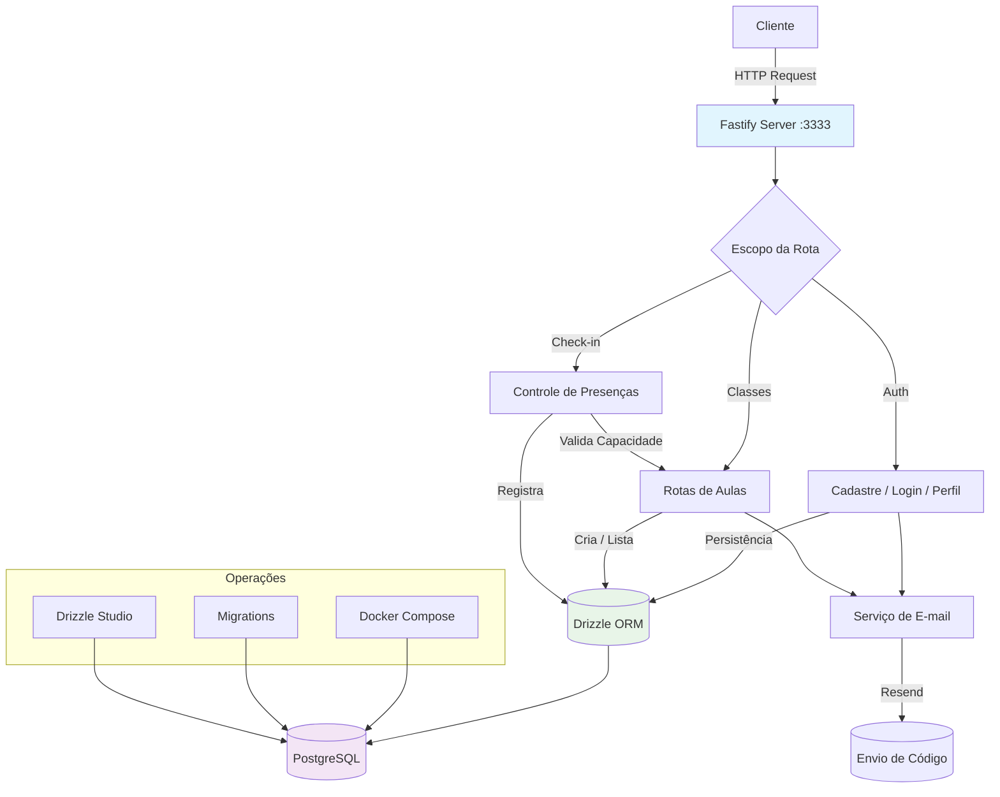
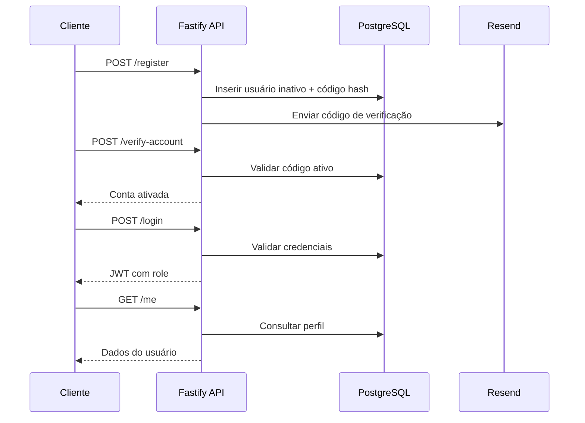

# Another Backend

Este é um backend Node.js construído com Fastify, Drizzle ORM e PostgreSQL.

## Fluxo Principal da Aplicação



## Arquitetura

### Stack Tecnológica
- **Fastify**: Framework web para servidor HTTP
- **Drizzle ORM**: Toolkit type-safe para PostgreSQL  
- **TypeScript + tsx**: Execução direta de módulos ESM com hot reload amigável
- **PostgreSQL**: Database rodando em container Docker

### Estrutura do Projeto
```
src/
├── app.ts              # Registra rotas e tratadores globais
├── server.ts           # Ponto de entrada da aplicação
├── routes/
│   ├── auth/           # Fluxo de cadastro, login e verificação
│   ├── classes/
│   │   ├── create-class.ts   # Criação de aulas com validação Zod
│   │   └── get-classes.ts    # Consulta de aulas com agregação de check-ins
│   └── checkin/
│       └── create-checkin.ts # Controle de presença antes do início da aula
├── services/
│   └── mail/
│       ├── resend.ts         # Cliente Resend para e-mails de verificação
│       └── templates/        # Componentes React usados nos envios
└── database/
    ├── client.ts       # Configuração do cliente Drizzle
    └── schema.ts       # Definições do schema do database
```

## Comandos de Desenvolvimento

```bash
# Iniciar servidor de desenvolvimento com hot reload
npm run dev

# Operações de database
npm run db:generate    # Gerar migrations a partir de mudanças no schema
npm run db:migrate     # Executar migrations pendentes
npm run db:studio      # Abrir Drizzle Studio para inspeção do database

# Operações Docker
docker compose up      # Iniciar database PostgreSQL
```

## Configuração do Database

A aplicação espera uma variável de ambiente `DATABASE_URL`. O `docker-compose.yml` incluso fornece uma instância PostgreSQL 17 com credenciais padrão (admin/admin) na porta 5432.

## Detalhes de Implementação

- Execução de TypeScript via `tsx` com suporte completo a módulos ECMAScript
- Schema do database usa chaves primárias UUID com valores padrão aleatórios
- Migrations do Drizzle são armazenadas no diretório `./drizzle`
- Servidor roda na porta 3333 por padrão

## Diagrama Relacional (ERD)
```text
BELTS (id PK, belt, required_classes, created_at)
    ^
    | beltId
USERS (id PK, name, email, password, role, is_active, belt_id FK -> BELTS.id,
      created_at, updated_at)
    ^
    | instructorId
CLASSES (id PK, title, description, date, start_time, end_time, capacity,
        status, instructor_id FK -> USERS.id, category_id FK -> CATEGORIES.id,
        created_at)
    ^
    | classId
CHECKINS (id PK, user_id FK -> USERS.id, class_id FK -> CLASSES.id,
         created_at) UNIQUE (user_id, class_id)

CATEGORIES (id PK, type, description, created_at)

EMAIL_CONFIRMATIONS (id PK, code_hash, expires_at, is_consumed,
                    user_id FK -> USERS.id, created_at)
```
- `users.beltId` referencia `belts.id` para controlar progressão de faixa.
- `classes.categoryId` vincula categorias como Kids, Competição ou Avançado.
- `checkins` aplica unicidade por aluno/aula para evitar duplicidade e remove dependências via cascade.
- `email_confirmations.userId` herda regras de cascade para manter o histórico limpo.

## Diagrama Mermaid


## Novas Funcionalidades
- Cadastro envia códigos de verificação via Resend e mantém hashes no PostgreSQL com Drizzle.
- Reenvio de código impede duplicatas ativas e reutiliza a expiração configurável de 10 minutos.
- Verificação de conta consome códigos dentro de uma transação e libera o usuário (`isActive = true`).
- Login valida credenciais com bcrypt, bloqueia contas inativas e retorna JWT assinado com role.
- Rota `/me` usa middleware JWT, schemas Zod e handler de erros centralizado para respostas consistentes.
- Rota `POST /create-class` permite que instrutores ou administradores montem aulas informando agenda, lotação e responsáveis.
- Rota `GET /get-classes` lista aulas com contagem de participantes e nomes dos alunos confirmados, com filtro opcional por data.
- Rota `POST /create-checkin` garante controle de presença impedindo duplicidades e bloqueando check-ins após o início da aula.
- Serviço `resendVerificationEmail` centraliza o envio de e-mails transacionais via Resend com template React tipado.
