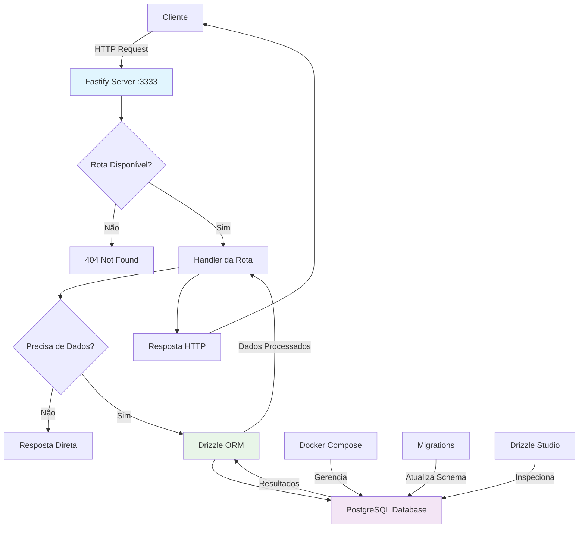
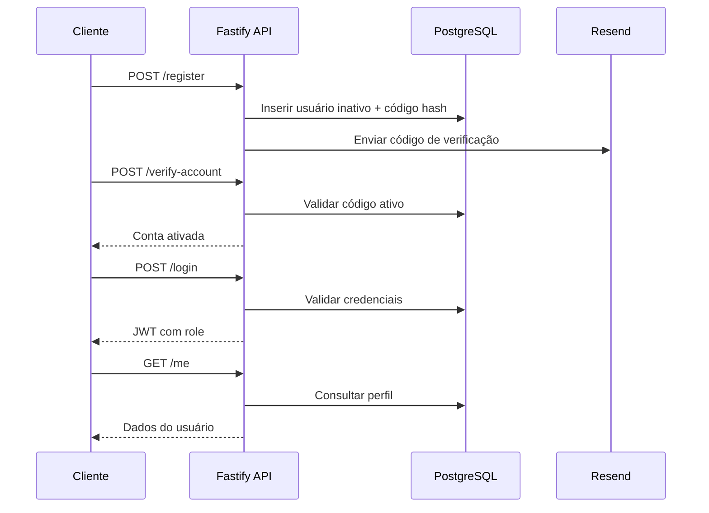

# Another Backend

Este é um backend Node.js construído com Fastify, Drizzle ORM e PostgreSQL.

## Fluxo Principal da Aplicação



## Arquitetura

### Stack Tecnológica
- **Fastify**: Framework web para servidor HTTP
- **Drizzle ORM**: Toolkit type-safe para PostgreSQL  
- **TypeScript**: Usando strip-types experimental para execução em runtime
- **PostgreSQL**: Database rodando em container Docker

### Estrutura do Projeto
```
src/
├── server.ts           # Ponto de entrada da aplicação
└── database/
    ├── client.ts       # Configuração do cliente Drizzle
    └── schema.ts       # Definições do schema do database
```

## Comandos de Desenvolvimento

```bash
# Iniciar servidor de desenvolvimento com hot reload
npm run dev

# Operações de database
npm run db:generate    # Gerar migrations a partir de mudanças no schema
npm run db:migrate     # Executar migrations pendentes
npm run db:studio      # Abrir Drizzle Studio para inspeção do database

# Operações Docker
docker compose up      # Iniciar database PostgreSQL
```

## Configuração do Database

A aplicação espera uma variável de ambiente `DATABASE_URL`. O `docker-compose.yml` incluso fornece uma instância PostgreSQL 17 com credenciais padrão (admin/admin) na porta 5432.

## Detalhes de Implementação

- Usa a flag `--experimental-strip-types` do Node.js para execução direta de TypeScript
- Schema do database usa chaves primárias UUID com valores padrão aleatórios
- Migrations do Drizzle são armazenadas no diretório `./drizzle`
- Servidor roda na porta 3333 por padrão

## Diagrama Relacional (ERD)
```text
BELTS (id PK, belt, required_classes, created_at)
    ^
    | beltId
USERS (id PK, name, email, password, role, is_active, belt_id, created_at, updated_at)
    ^
    | userId
EMAIL_CONFIRMATIONS (id PK, code_hash, expires_at, is_consumed, created_at)
```
- `users.beltId` referencia `belts.id` para determinar a graduação do aluno.
- `email_confirmations.userId` referencia `users.id` e herda regras de cascade para manter o histórico limpo.

## Diagrama Mermaid


## Novas Funcionalidades
- Cadastro envia códigos de verificação via Resend e mantém hashes no PostgreSQL com Drizzle.
- Reenvio de código impede duplicatas ativas e reutiliza a expiração configurável de 10 minutos.
- Verificação de conta consome códigos dentro de uma transação e libera o usuário (`isActive = true`).
- Login valida credenciais com bcrypt, bloqueia contas inativas e retorna JWT assinado com role.
- Rota `/me` usa middleware JWT, schemas Zod e handler de erros centralizado para respostas consistentes.

